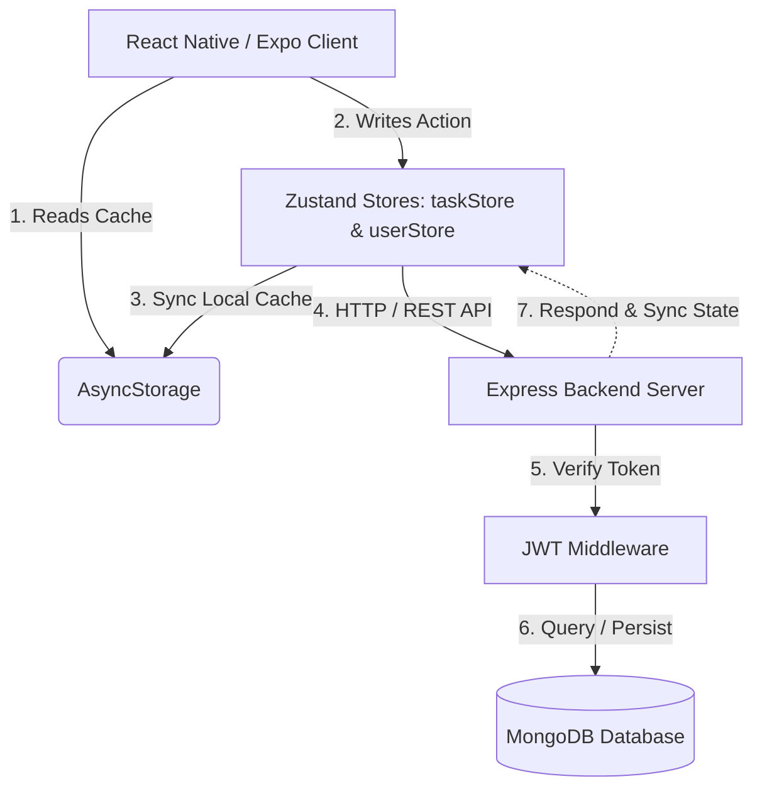

# Tick-It OS — Gamified Startup Task Orchestration Engine

Tick-It OS is a gamified startup task coordinator and personal execution system. It is built as a hybrid mobile application using **React Native / Expo** and supported by a **Node.js, Express, and MongoDB** backend. 

The application utilizes the **Eisenhower Matrix (Urgent-Important Quadrants)**, combining heuristic text-classification engines, simulated team role execution, workspace isolation, a Pomodoro focus tracker, and an AI-driven command brief to optimize a developer's productivity index.

---

## 🗺️ System Walkthrough

Tick-It OS separates execution context into two primary states: **Personal Workspaces** (for atomic habit building and individual productivity) and **Startup Organizations** (for high-velocity team collaboration).

### 1. Registration & Role Selection
* **Role-Based Profiles:** During signup, users select their specialized role (e.g., `founder`, `co_founder`, `tech_lead`, `ui_ux_designer`, `backend_developer`, `ai_engineer`, `marketing_lead`, `team_member`).
* **Startup Linkage:** Founders can instantiate a new organization, generating a unique code (e.g., `TICK-1234`). Other members join existing organizations using this code, creating an isolated operational context.
* **Onboarding & Tour:** A built-in guide guides users through their dashboards, matrix rules, and streak requirements.
* *References:* [server/routes/auth.js](file:///c:/Users/dell/Desktop/Xero/server/routes/auth.js), [server/models/User.js](file:///c:/Users/dell/Desktop/Xero/server/models/User.js)

### 2. The Eisenhower Matrix Board
* **Automatic Classification:** When typing a task (e.g., `"Design slide deck by tonight"`), the heuristic classifier in [my-app/src/utils/classifier.ts](file:///c:/Users/dell/Desktop/Xero/my-app/src/utils/classifier.ts) evaluates keywords to determine **Urgency** and **Importance**.
* **Priority Scores:** The system calculates a priority score (0–100) using the formula:
  $$\text{Priority Score} = (\text{Urgency} \times 0.4) + (\text{Importance} \times 0.4) + (\text{Deadline Proximity} \times 0.2)$$
* **Quadrant Assignment:** Tasks are distributed into four quadrants:
  1. **Q1: Do First** (Urgent & Important — e.g. bugs, crashes, blockages)
  2. **Q2: Schedule** (Important, Not Urgent — e.g. architecture, strategic plans)
  3. **Q3: Delegate** (Urgent, Not Important — e.g. reviews, routine updates)
  4. **Q4: Eliminate** (Not Urgent, Not Important — e.g. low-priority suggestions)
* **AI reasoning logs:** Every task contains structured AI reasoning text detailing *why* it was placed in its quadrant.
* *References:* [my-app/src/app/(tabs)/dashboard.tsx](file:///c:/Users/dell/Desktop/Xero/my-app/src/app/(tabs)/dashboard.tsx), [server/models/Task.js](file:///c:/Users/dell/Desktop/Xero/server/models/Task.js)

### 3. Task Lifecycle & Workspace Isolation
* **Visibility Filtering:** 
  * In the **Personal Workspace**, only tasks created by the logged-in user are visible.
  * In the **Startup Workspace**, strict isolation and team visibility filtering apply:
    * The **Founder** can view all organization tasks.
    * **Team members** only see tasks that are: (1) unassigned, (2) assigned to them, or (3) mention their name/email/role (e.g., `@tech_lead`, `@john` in the text). Tasks assigned to or mentioning others are hidden.
* **Collaboration Tools:**
  * **Subtasks:** Subtask status changes dynamically recompute overall task progress percentage.
  * **Comments & Mentions:** Real-time feedback thread directly within each task modal.
  * **Task Approval Flows:** Teammates request completion approval on tasks. Founders, Co-Founders, and Tech Leads can **Approve** (marks task complete, awards XP) or **Request Changes** (returns task progress to 70% with constructive feedback). Tech Leads are restricted from approving their own assigned tasks.
* *References:* [my-app/src/store/taskStore.ts](file:///c:/Users/dell/Desktop/Xero/my-app/src/store/taskStore.ts), [server/routes/tasks.js](file:///c:/Users/dell/Desktop/Xero/server/routes/tasks.js)

### 4. Gamification Engine
* **XP Leveling System:** Completing tasks awards XP based on base quadrant values, priority score bonuses, streak multipliers, subtask completion count, and on-time completion bonuses.
* **Milestone Badges:** Dynamic locks check if users satisfy requirements for badges such as **Deep Work** (completing focus sessions), **Consistent** (maintaining daily streaks), **Early Bird** (completing tasks before 8:00 AM), and **Fire Fighter** (clearing Q1 items).
* **Startup Performance Metrics:**
  * *Founder Score:* Reflects organization completion rate vs. overdue penalties.
  * *Consistency Score:* Combines streak lengths with general shipment logs.
  * *Hackathon Score:* Tracks critical path completion speeds.
* *References:* [my-app/src/utils/xp.ts](file:///c:/Users/dell/Desktop/Xero/my-app/src/utils/xp.ts), [server/models/Gamification.js](file:///c:/Users/dell/Desktop/Xero/server/models/Gamification.js)

### 5. Focus Mode, Timeline & Command Brief
* **Focus Timer:** An interactive Pomodoro focus clock records sessions and triggers deep work badge checks.
* **Timeline:** Tracks and highlights startup organizational milestones chronological order (e.g., tasks completed, organization code shares, member updates).
* **Intelligence Screen:** 
  * *Command Brief:* Daily critical path map highlighting overloaded queues, blocker updates, and slide designs.
  * *Burnout Risk Analysis:* Monitors high-risk backlogs and warns when developers exceed safe loading thresholds.
* *References:* [my-app/src/app/(tabs)/focus.tsx](file:///c:/Users/dell/Desktop/Xero/my-app/src/app/(tabs)/focus.tsx), [my-app/src/app/(tabs)/timeline.tsx](file:///c:/Users/dell/Desktop/Xero/my-app/src/app/(tabs)/timeline.tsx), [my-app/src/app/(tabs)/intelligence.tsx](file:///c:/Users/dell/Desktop/Xero/my-app/src/app/(tabs)/intelligence.tsx)

---

## 🔀 Data Flow Architecture

The data architecture handles offline-first mobile operations alongside real-time server synchronization.



### 1. local Hydration Flow
1. Upon boot, [my-app/src/store/userStore.ts](file:///c:/Users/dell/Desktop/Xero/my-app/src/store/userStore.ts) checks for `tickit_jwt_token` and the user profile state inside `AsyncStorage`.
2. Simultaneously, [my-app/src/store/taskStore.ts](file:///c:/Users/dell/Desktop/Xero/my-app/src/store/taskStore.ts) hydates cached tasks from `tickit_tasks` key.
3. This ensures the app is interactive immediately, even without internet access.

### 2. Server Synchronization Flow
1. If a valid JWT token is detected, the client triggers background sync API requests to fetch fresh information:
   * `GET /api/auth/profile`
   * `GET /api/auth/members`
   * `GET /api/gamification`
   * `GET /api/tasks?workspace=<activeWorkspace>`
2. Any client-side action (e.g. adding a task, completing a task, updating profile details) is optimistically rendered on the client board, cached locally, and then written via HTTPS requests to the backend server.
3. If the server request fails, the local Zustand states fallback to local-only persistence until the next network cycle.

### 3. API Base URL Resolution
To prevent developers from needing to hardcode their IP addresses during local testing on emulators or real hardware, [my-app/src/utils/api.ts](file:///c:/Users/dell/Desktop/Xero/my-app/src/utils/api.ts) dynamically resolves the API address:
* Prioritizes production env `process.env.EXPO_PUBLIC_API_URL`.
* Resolves `localhost:5000` for web environments.
* Extracts Expo Host URI (`hostUri`) to dynamically target the development machine's local IP (e.g. `http://192.168.x.x:5000/api`) when running on Android emulators, iOS simulators, or physical devices via Expo Go.
* Defaults to emulator host loopback `10.0.2.2:5000/api` on Android.

---

## ⚙️ Installation Guide

### Prerequisites
* [Node.js](https://nodejs.org) (v18 or higher recommended)
* [MongoDB Atlas](https://www.mongodb.com/cloud/atlas) cluster (or local MongoDB database service running)
* Android Studio (with emulator configured) or Expo Go app on a physical device

---

### Backend Server Setup

1. **Navigate to the server directory:**
   ```bash
   cd server
   ```

2. **Install node dependencies:**
   ```bash
   npm install
   ```

3. **Configure Environment Variables:**
   Create a `.env` file in the `server` root directory:
   ```env
   PORT=5000
   MONGO_URI=mongodb+srv://<username>:<password>@cluster.mongodb.net/tickit?retryWrites=true&w=majority
   JWT_SECRET=your_jwt_secret_key_here
   NODE_ENV=development
   ```

4. **Launch Server:**
   * Run in development mode (auto-reloading via `nodemon`):
     ```bash
     npm run dev
     ```
   * Run in standard mode:
     ```bash
     npm start
     ```

---

### Frontend App Setup

1. **Navigate to the frontend directory:**
   ```bash
   cd my-app
   ```

2. **Install client-side dependencies:**
   ```bash
   npm install
   ```

3. **Configure Frontend Environment Variables (Optional):**
   Create a `.env` file in the `my-app` directory:
   ```env
   EXPO_PUBLIC_API_URL=http://your-backend-ip:5000/api
   ```
   > [!NOTE]
   > For local development, you can leave this empty. The app will automatically resolve your developer machine's IP address.

4. **Launch Expo Packager:**
   ```bash
   npm start
   ```
   * Press `a` to open on the connected Android emulator.
   * Press `i` to open on the connected iOS simulator.
   * Scan the terminal QR code using your phone's camera (iOS) or the Expo Go App (Android) to test on a physical device.

---

## 🚀 Deployment Guide

For a thorough production setup, follow the deployment order outlined below.

### 1. Database Configuration
1. Register a cluster on [MongoDB Atlas](https://www.mongodb.com/cloud/atlas).
2. Create a Database User with read and write permissions.
3. Under **Network Access**, add IP address `0.0.0.0/0` to allow the Render server instances to communicate with the database (since Render web servers run on dynamic IP blocks).
4. Extract the Mongo Driver connection URL.

### 2. Deploying Backend to Render
1. Push your project or `server` directory to a GitHub repository.
2. Log in to [Render](https://render.com) and create a new **Web Service**.
3. Link your repository and set the following parameters:
   * **Root Directory:** `server`
   * **Runtime:** `Node`
   * **Build Command:** `npm install`
   * **Start Command:** `node index.js`
   * **Instance Type:** `Free`
4. Add environment variables under the **Environment** tab:
   * `MONGO_URI`: *[Your MongoDB Atlas Connection URL]*
   * `PORT`: `10000`
   * `NODE_ENV`: `production`
   * `JWT_SECRET`: *[A secure, random hashing string]*
5. Click **Deploy Web Service** and copy the generated public URL (e.g., `https://tick-it-backend.onrender.com`).

### 3. Compiling the Android APK (Early Release Testing)
To compile an Android APK file that can be distributed directly to testing devices without using Google Play Store deployment channels, follow either method:

#### Method A: Expo Application Services (EAS) Cloud Build
1. Install EAS CLI globally:
   ```bash
   npm install -g eas-cli
   ```
2. Log in to your Expo account:
   ```bash
   eas login
   ```
3. Verify your configuration profile inside [my-app/eas.json](file:///c:/Users/dell/Desktop/Xero/my-app/eas.json). Ensure the `preview` profile has the android buildType set to `apk`:
   ```json
   "preview": {
     "distribution": "internal",
     "android": {
       "buildType": "apk"
     }
   }
   ```
4. Define your production server endpoint in [my-app/.env](file:///c:/Users/dell/Desktop/Xero/my-app/.env) (so that the APK bundle embeds the correct URL):
   ```env
   EXPO_PUBLIC_API_URL=https://tick-it-backend.onrender.com/api
   ```
5. Trigger the remote build command inside `my-app`:
   ```bash
   eas build -p android --profile preview
   ```
6. Download the resulting `.apk` file using the terminal QR code or from the Expo Dashboard and install it on testing devices.

#### Method B: Local Gradle Assembler
This requires JDK 17+ and the Android SDK to be configured on your local operating system.
1. Generate the native Android project directory inside `my-app`:
   ```bash
   npx expo prebuild --platform android
   ```
2. Build the release APK locally using Gradle:
   ```bash
   cd android
   ./gradlew assembleRelease
   ```
3. Retrieve the executable APK file from the output directory:
   `my-app/android/app/build/outputs/apk/release/app-release.apk`
